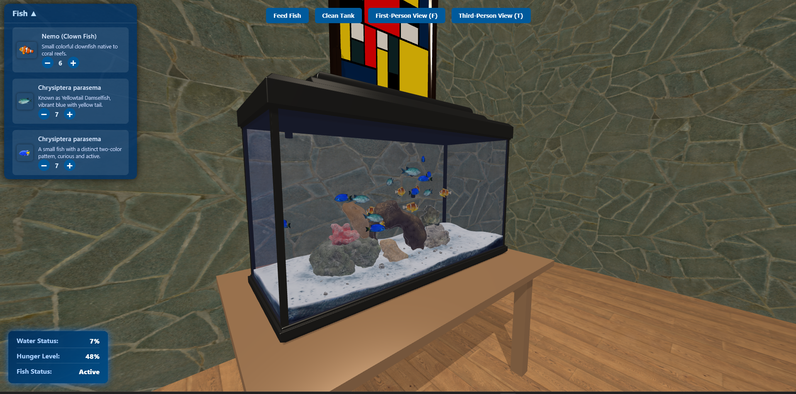

3D Virtual Aquarium Project

Live Demo: https://aquariumprojectua.netlify.app/menu.html

Project Description
This interactive 3D aquarium simulation built with Three.js allows users to:

Explore a beautifully rendered virtual aquarium environment

Manage different fish species with realistic behaviors

Control aquarium maintenance (feeding and cleaning)

Switch between first-person (fish view) and third-person perspectives

Key Features
🐠 Fish Management System
Add/remove 3 different fish species

Dynamic fish behaviors based on hunger levels

Realistic swimming animations and movement patterns

🌊 Aquarium Environment

Interactive aquarium accessories and decorations

Dynamic dirt system affecting water clarity

🎮 Interactive Controls
Creative Mode: Free camera movement (OrbitControls)

Fish Mode: First-person perspective swimming

Responsive UI panel for aquarium management

🖥️ Technical Implementation
Built with Three.js

Custom fish behavior algorithms

Optimized performance with bounding boxes

Responsive design for various screen sizes

How to Use
Navigation Controls:

T - Switch to third-person (creative) view

F - Switch to first-person (fish) view

Mouse drag - Rotate view (in creative mode)

Scroll wheel - Zoom in/out

Aquarium Management:

Use the fish menu to add/remove fish

Click "Feed Fish" to reset hunger levels

Click "Clean Aquarium" to restore water clarity

Pause Menu:

Press ESC to access pause menu

Options to continue, return to main menu, or view about page

Technical Requirements
Modern browser with WebGL support

Three.js (included in project)

No additional dependencies required

Future Enhancements
Additional fish species

Day/night cycle

More interactive decorations

Mobile touch controls

Multiplayer functionality

